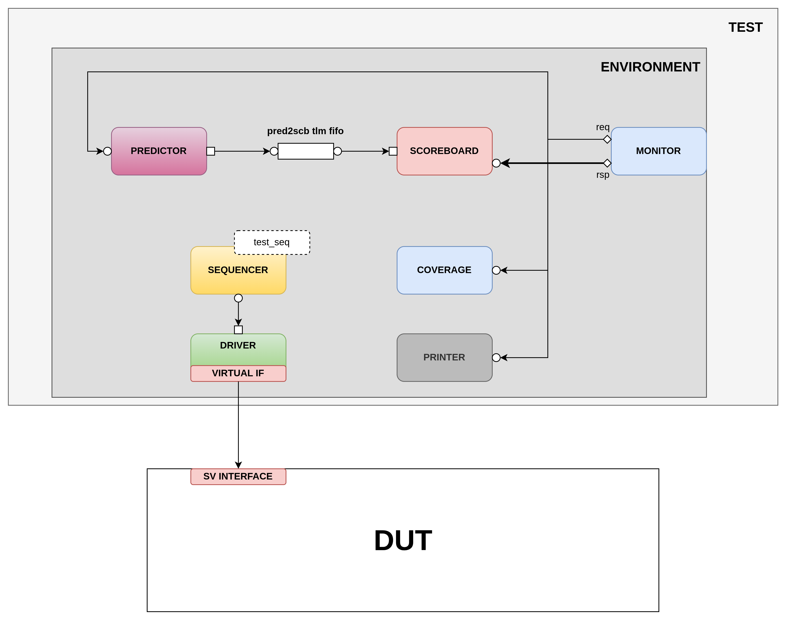

This repository contains the implementation and testbench architecture for a Pentium 4 Adder and a Register-File with Windowing feature, together with the `LaTeX` code used for the technical report. Both P4_ADDER and RF_WINDOWING are designed using VHDL for implementation.

# P4_ADDER Implementation and Testing

## Directory Structure

The Pentium 4 Adder Testbench is organized into the following main directories:

- `src/`: Contains the VHDL implementation of the P4_ADDER.
- `tb/`: Contains the UVM testbench 
- `sim/`: Contains the simulation scripts and after simulation, the coverage reports.

## Testbench and Verification (tb/)
This directory contains all the SystemVerilog files developed during this project, needed for verification.

##### P4 INTERFACE (tb/p4_if.sv)
This file defines the UVM interface for the Pentium 4 adder module. It encapsulates the signals involved in the communication between the testbench and the design,providing a clear abstraction for stimulus generation and response analysis.
##### DRIVER (tb/driver.svh) 
The driver class, an integral component of the UVM testbench, generates transactions and drives them into the design. It interfaces with the UVM environment and the DUT (Design Under Test), ensuring efficient and synchronized communication.

##### SCOREBOARD (tb/scoreboard.svh) 
The scoreboard class verifies the correctness of the DUT’s outputs by comparing them with expected results. It plays a pivotal role in ensuring the accuracy of the verification process.
##### PRINTER (tb/printer.svh) 
The printer class generates informative messages during simulation, aiding in debugging and understanding the simulation progress. This component is especially useful for verbose tests.
##### COVERAGE (tb/p4_cov.svh) 
This file implements functional coverage collection for the Pentium 4 adder module. It defines coverpoints and crosses to track the exercised scenarios during simulation.
##### UVM ENVIRONMENT (tb/tester_env.svh) 
The tester environment encapsulates the UVM components, creating an organized and structured testbench architecture. It promotes modularization and easy
integration of various verification components.
##### VERBOSE TEST (tb/verbose_test.svh) 
This class represents a UVM test using a verbose approach, where detailed logs and information about the simulation are generated. It showcases the power of UVM in providing comprehensive insights during testing.
##### QUIET TEST (tb/quiet_test.svh) 
The quiet test class demonstrates a UVM test with minimal logs, suitable for efficiency-focused simulations. It illustrates the versatility of UVM in adapting to different simulation needs.
##### P4 PACKAGE (tb/p4_pkg.sv) 
The package file includes import statements, global variables, and component inclusion macros. It provides a centralized place for defining and managing resources shared across the testbench.
##### TOP MODULE (tb/top.sv) 
The top module instantiates the Pentium 4 interface, wraps the design, and orchestrates the test execution. It highlights the modularization and configurability of the verification environment.

## Simulation and Coverage report (sim/)
This directory contains scripts to compile, simulate, and generate coverage reports:

- `simulateP4.sh`: The shell script that starts the simulation, is the only script we need to run
- `run.do`: run.do - The simulation script for QuestaSim compiles and runs the testbench, showcasing the integration of the testbench components and the execution of UVM-based tests.
- `compile_sv.do`: A script to compile the necessary files for simulation.

# RF WINDOWING Implementation and Testing
## Schematic:

## Directory Structure

As well as the P4 ADDER, the RF is organized into the following main directories:
- `src/`: Contains the VHDL implementation of the RF_WINDOWING.
- `tb/`: Contains the UVM testbench 
- `sim/`: Contains the simulation scripts and after simulation, the coverage reports.

## RF UVM TESTBENCH ARCHITECTURE (/tb)
This directory contains the SystemVerilog files needed for UVM verification of the Register File.

##### RF INTERFACE (tb/rf_if.sv): 
This SystemVerilog interface models the register file’s input and output signals. It covers clock, reset, read and write enables, addresses, data ports, and memory bus interactions.
##### UVM PACKAGE (tb/rf_pkg.sv): 
This package encompasses various components for the register file testbench. It includes enums for operation types, a global virtual interface to the P4_if, and references to the UVM components.
##### GENERIC PACKAGE (tb/generic_pkg.sv): 
This package defines the local parameters of the DUT(NBITS, NREGISTERS,Number of windows, Numbers of registers in each block and number of global registers) that are used by almost all the modules. 
##### DATA TRANSACTION (tb/rf_data.svh): 
This SystemVerilog structure defines the format of data transactions exchanged between the testbench and the register file.
##### REQUEST TRANSACTION (tb/rf_req.svh): 
This SystemVerilog structure outlines the format of request transactions to the register file.
##### INTERFACE BASE (tb/interface_base.svh): 
This module defines the base interface containing signals for clock, reset, read/write enables, addresses, and data.
##### RESPONDER (tb/responder.svh): 
The responder class simulates the register file’s behavior. It processes requests, maintains the simulated memory, and generates responses.
##### DRIVER (tb/driver.svh): 
The driver class drives requests to the register file and forwards responses to the sequencer.
##### MONITOR (tb/monitor.svh): 
The monitor class captures transactions on the register file interface for analysis.
##### PREDICTOR (tb/predictor.svh): 
This class processes register file requests, simulates memory operations, and generates responses for comparison.
##### COMPARATOR (tb/comparator.svh): 
The comparator class compares actual and predicted responses from the register file for correctness verification.
##### PRINTER (tb/printer.svh): 
This parameterized class prints incoming transactions to the screen for analysis.
##### UVM ENVIRONMENT (tb/tester_env.svh): 
The tester environment class brings together testbench components, including sequences, drivers, monitors, predictors, comparators, and coverage modules.
##### TEST SEQUENCE (tb/test_seq.svh): 
The test sequence class defines test scenarios, encompassing operations like read, write, call, return, and reset, along with subroutines.
##### COVERAGE (tb/coverage.svh): 
The coverage class tracks the coverage of different operations, addresses, and ports in the register file interactions.
##### VERBOSE TEST (tb/verbose_test.svh): 
This test class sets up the environment for running tests and collecting coverage data with higher verbosity.
##### TOP MODULE (tb/top.sv): 
The top module instantiates the register file interface and the testbench components, initiating the test sequence

## Simulation and Coverage report (sim/)
This directory contains scripts to compile, simulate, and generate coverage reports:

- `simulateRF.sh`: The shell script that starts the simulation, is the only script we need to run
- `run.do`: This QuestaSim script compiles, simulates, and captures coverage information for the RF testbench.
- `compile_sv.do`: A script to compile the necessary files for simulation.

## Running the Tests
To run the simulations, we only need to run the `simulateP4.sh` or `simulateRF.sh` script depending on the component we want to test inside the corresponding `/sim` directory.
